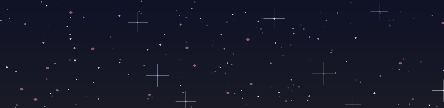

<!--
　　✦ ･ﾟ✧　　　CLRenYa の GitHub Profile　　　✧ﾟ･ ✦
　　欢迎路过的旅行者,这里由魔法与代码驱动 ✨
-->

<div align="center">

<!-- 🌌 星空粒子动态横幅(本地 GIF:闪烁星群 + 双流星 + 樱花瓣飘移,无缝循环) -->


<!-- 彩虹跑马灯标题(URL 已全量百分号编码,规避 GitHub camo 代理 403) -->


```
 ░▒▓█▓▒░ ░▒▓█▓▒░ BOOT SEQUENCE ▒▓█▒░ ▒▓█▒░ ▒▓█▒░
   >> 加载中... 二次元领域展开完毕 🌸
```

<!-- 技术栈徽章 · 每个图标独立,悬停显示名称,点击跳转官网 -->
<a href="https://www.python.org" target="_blank"></a>
<a href="https://www.typescriptlang.org" target="_blank"></a>
<a href="https://developer.mozilla.org/docs/Web/JavaScript" target="_blank"></a>
<a href="https://html.spec.whatwg.org" target="_blank"></a>
<a href="https://www.csswg.org" target="_blank"></a>
<a href="https://react.dev" target="_blank"></a>
<a href="https://vuejs.org" target="_blank"></a>
<a href="https://nodejs.org" target="_blank"></a>
<a href="https://git-scm.com" target="_blank"></a>
<a href="https://github.com" target="_blank"></a>
<a href="https://www.docker.com" target="_blank"></a>
<a href="https://www.linux.org" target="_blank"></a>

<small>✦ 悬停查看名称 · 点击直达官网 ✦</small>

</div>

---

### 🌸 About Me ｜ 自己紹介

```console
$ whoami
> CLRenYa —— 一名游走在现实与二次元之间的开发者
> 🌱 正在修炼:新框架 / 新语言 / 新番同步追击中
> 🔭 当前副本:神秘项目开发中(剧透禁止 🤫)
> ⚡ 必杀技:咖啡因驱动的通宵编程
> 💬 Ask me about:代码、动漫、或者深夜emo文学
> 📫 Reach me:GitHub Issues 或主页邮箱
```

- 😄 口头禅:`「代码写得好,头发少不了」`
- 🎮 当我不在写代码时,我可能在:打游戏 / 补番 / 计划补番

---

### 📊 Battle Data ｜ 战斗面板

<div align="center">

<!-- 访问计数 · 访客雷达 -->


<a href="https://github.com/CLRenYa">
  
</a>
<a href="https://github.com/CLRenYa?tab=repositories">
  
</a>
<a href="https://github.com/CLRenYa?tab=followers">
  
</a>
<a href="https://github.com/CLRenYa/CLRenYa">
  
</a>

<!-- 🐍 贪吃蛇贡献图 · 由 GitHub Actions (Platane/snk) 每天自动生成,亮/暗色自适应 -->
<picture>
  <source media="(prefers-color-scheme: dark)" srcset="https://github.com/CLRenYa/CLRenYa/blob/gh-pages/github-snake-dark.svg?raw=true" />
  <source media="(prefers-color-scheme: light)" srcset="https://github.com/CLRenYa/CLRenYa/blob/gh-pages/github-snake.svg?raw=true" />
  
</picture>

</div>

---

### 🎌 Otaku Status ｜ 二次元状态

<div align="center">

<table>
<tr>
<td align="center">

**🔥 今日状态**


</td>
<td align="center">

**🍙 能量来源**


</td>
<td align="center">

**🌙 出没时段**


</td>
</tr>
</table>

</div>

---

### 🕹️ 異世界転生テスト ｜ 互动小游戏区

<div align="center">

*路过的旅人,请留步——这里封存着两座微型异世界,点开即是命运 🎲*

#### 🎰 今日一抽 · 命运扭蛋机

<details>
<summary>✨ 点击抽取你的今日 SSR(剧透禁止,先抽再看)</summary>

<table>
<tr>
<td align="center" width="33%">

🎁 **奖励 A**

**「无限咖啡券」**

*R 稀有度*

效果:通宵 debug 不掉 SAN 值

</td>
<td align="center" width="33%">

🎁 **奖励 B**

**「发量再生药水」**

**SSR!!!**

效果:编译 0 warning,头发 +9999

</td>
<td align="center" width="33%">

🎁 **奖励 C**

**「史莱姆小弟 ×1」**

*N 稀有度*

效果:替你 review 昨天的代码

</td>
</tr>
</table>

> 系统提示:抽到 SSR 的访客请在 Issues 区大声炫耀 📢

</details>

#### ⚔️ 文字冒险 ·《深夜仓库的地下城》

<details>
<summary>🚪 推开你面前这扇门(多周目剧情,慎入)</summary>

> 2026 年的某个深夜,你路过 CLRenYa 的 GitHub 仓库,
> 发现 README 底部有一扇发着微光的门……

<details>
<summary>👉 选项一:推门而入</summary>

> 门后是一间赛博机房,屏幕上滚动着 63 次贡献记录。
> 一只粉色贪吃蛇从屏幕里爬出来,对你吐了吐信子。
>
> 「勇闯者,回答我一个问题方可离开——」

<details>
<summary>🐍 蛇の谜题:这段代码的输出是?</summary>

```python
print("こんにちは, world" [::-1][:6])
```

<details>
<summary>🅰️ 答案是「逆さ文字の魔法」</summary>

> ✅ 正确!蛇满意地让开了路。
> 你获得了成就徽章:


> *通关彩蛋:把这段故事讲给你的下一位访客。*

</details>

<details>
<summary>🅱️ 答案是「IndexError」</summary>

> ❌ 错误。Python 切片永不越界——
> 蛇大笑三声,把你变成了 README 里的一个标点符号。
>
> **( 已存档 · 点击左上角浏览器后退读档,或收起本层重新选择 )**

</details>

</details>

</details>

<details>
<summary>👉 选项二:转身就跑</summary>

> 你选择了理智。
> 但跑出三步后,地上出现一行发光的字:
>
> ```
> git commit -m "逃跑失败,已自动暂存"
> ```
>
> 你的脚被 `git add .` 住了。收起本层,回到选项一吧 😇

</details>

</details>

<small>✦ 本区域由魔法驱动,无需 JavaScript 亦可畅玩 ✦</small>

</div>

---

### 🌸 今日のねこちゃん ｜ 今日猫娘

<div align="center">

*由 GitHub Actions 每天 09:00(北京时间)从 [nekos.moe](https://nekos.moe) 自动抽取一张 SFW 二次元插画*
*—— 每天醒来,你的电子猫娘都会换一张新脸 🐾*

<details>
<summary>🐱 摸摸她的头(点击展开)</summary>

> 她眯起眼睛,发出了满足的呼噜声……
>
> 
>
> *（收起本层,她就会忘记刚才的事,你可以无限摸下去）*

</details>

<a href="https://nekos.moe" title="今日份的猫娘由 nekos.moe 赞助">
  
</a>

<small>✦ 图片每日自动更新 · 卡住了就点她一下重抽 ✦</small>

</div>

---

### 📡 电波传送 ｜ Teleport Portal

<div align="center">

> *「天空之所以美丽,是因为它连接着两个人的心。」* —— 《秒速5厘米》
>
> *「今天也是、代码与樱花一同飘落的一天。」* 🌸

<table>
<tr>
<td align="center" width="50%">

**📱 扫码直达我的 GitHub**


</td>
<td align="center" width="50%">

**🎧 今日 BGM**


<small>—— 循环到代码自动进入同步率 400% 状态</small>

</td>
</tr>
</table>

</div>

---

<div align="center">

```
 ░▒▓█▓▒░ MISSION COMPLETE ▒▓█▒░
　　✦ ･ﾟ✧　感謝观看,记得点个 Star 再走呀　✧ﾟ･ ✦
```

<a href="https://github.com/CLRenYa?tab=repositories">
  
</a>

</div>
